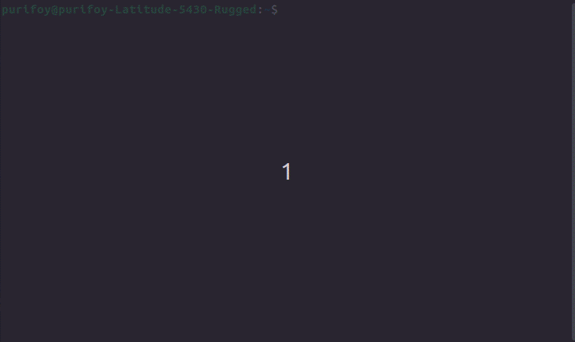

# Thread Pool Library

> A thread pool is a set of threads that are on call and waits for jobs to be available

This is a proper way to use threads as opposed to creating a new thread each time a job needs to be done
because it amounts to less resource consumption for the CPU.

## Resources

- https://docs.oracle.com/cd/E26502_01/html/E35303/ggedh.html

- https://en.wikipedia.org/wiki/Thread_pool

## This Library

Here is an example of thread pool being used in one of my projects.

In the pack end, the thread pool is waiting for a jobs to perform.  When it has been given the task of processing files, it executes that task and frees memory associated with that jobs arguments.

## How to Use

First, you need to initialize a valid thread pool instance of type ***threadpool_t***, then the following functions will be available to you.

1. threadpool_create (size_t ***thread_count***)

    This function returns a thread pool instance with a capacity (amount of threads you want to create) of ***thread_count***.

2. threadpool_shutdown (threadpool_t * ***pool_p***)

    This function shuts down all the threads associated with the thread pool instance ***pool_p***.

3. threadpool_destroy (threadpool_t ** ***pool_pp***)

    This function shuts down all the threads associated with the thread pool instance ***pool_pp*** if it hasn't already then destroys it, freeing up respective memory locations in the process.

4. threadpool_add_job (threadpool_t * ***pool_p***, job_f ***job***,
free_f ***del_f***, void * ***arg_p***)

    Add job to the queue for the next available thread to perform

    - ***pool_p*** : The valid pool to execute the job.
    - ***job*** : The job to be executed by the pool.
    - ***del_f*** : A user defined function to free and clean up ***arg_p***. If not required, set to NULL.
    - ***arg_p*** : The argument(s) required by the job, if any.

## Pre-requisites

Tested and functional on CMake 3.16 in Ubuntu 22.0.4 x64 architecture, may or may not work in earlier versions.

Need **common_static** to compile, otherwise portable across Linux systems

## Caveats and Limitations

The amount of threads that can spun up be should no more than **100** as there is a point of diminishing returns in regards to CPU performance

## Bugs or Issues

No known issues had been encountered